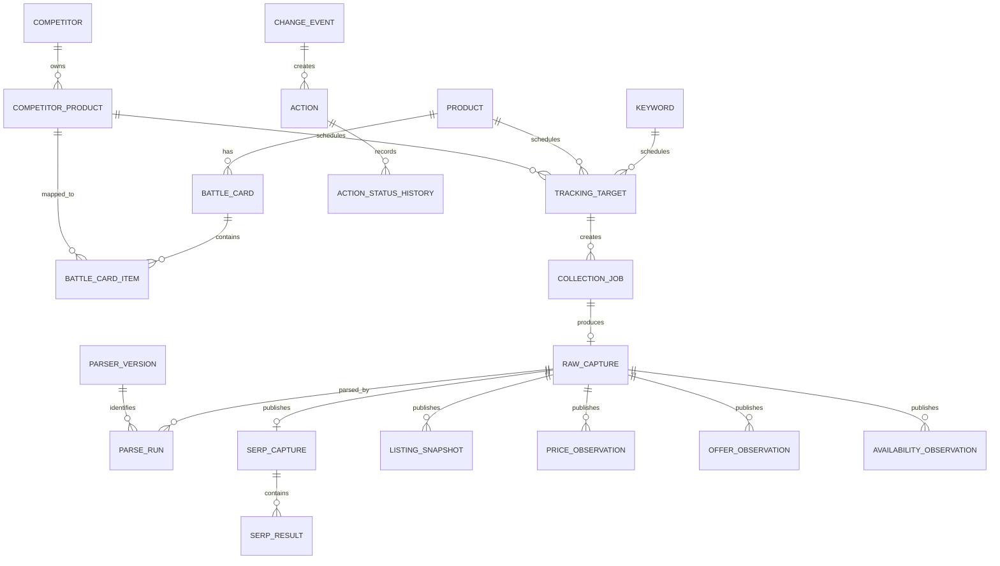

# Novel Signal — Project and Week 1 Technical Specification

**Release:** Week 1 / v0.1  
**Architecture:** Modular monolith with separate web, API, scheduler, worker, API-sync, and collector processes  
**Primary stack:** Python + FastAPI backend, Next.js frontend, PostgreSQL, Redis, Celery, Playwright, S3-compatible object storage

## 0. Ownership map

| Area | Primary owner | Review and integration |
| --- | --- | --- |
| S1 `modules/universe` | Akanksh | Palguna reviews schema and API |
| S2 `modules/keywords` | Akanksh | Palguna reviews contracts and UI integration |
| S3 `modules/visibility` | Akanksh | Palguna reviews published facts and UI integration |
| S4 `modules/ads` | Palguna | Akanksh supplies sponsored SERP observations from S3 |
| S5 `modules/listings` | Akanksh | Palguna reviews change-event contract |
| S6 `modules/commerce` | Akanksh | Palguna reviews change-event contract |
| S7 `modules/reviews` | Palguna | Later-week scope |
| S8 `modules/market_share` | Palguna | Later-week scope |
| S9 `modules/scorecards` | Palguna | Later-week scope |
| S10 `modules/actions` | Palguna | Consumes published changes from Akanksh's modules |
| S11 `modules/alerts` | Palguna | Consumes events and data-quality states |
| S12 `modules/collection` and marketplace adapters | Akanksh | Palguna reviews safety and operations integration |
| Shared web shell, auth, CI, deployment, observability | Palguna | Akanksh validates module integration |

Ownership means implementation, tests, documentation, and defect fixes. Review ownership does not move the implementation responsibility.

Week 1 source ownership follows module ownership:

- Akanksh owns Amazon SP-API ingestion, permitted Brand Analytics report ingestion, Google Search Console ingestion, and public Amazon.in collectors because they feed S1, S2, S3, S5, S6, and S12.
- Palguna owns Amazon Ads API and Meta integrations because they feed S4. Akanksh exposes shared keyword, product, raw-capture, and job contracts used by these integrations.

## 1. Architecture decision

Use one repository and one logical application, divided into clear modules. Do not build six microservices for a two-person team. Deploy processes separately only where their runtime needs differ.

```text
Next.js web
    |
FastAPI REST API
    |
PostgreSQL ------------------------- S3-compatible raw store
    |                                         ^
Scheduler -> Redis/Celery -> API sync or collector -> raw capture
                                  |             |
                                  +-> parser -> validator -> publisher
                                                        |
                                             observations/events/actions
```

Process boundaries:

- `web`: Next.js user interface.
- `api`: FastAPI configuration and query API.
- `scheduler`: creates idempotent due jobs.
- `worker`: parsing, validation, publication, change detection, and aggregates.
- `collector`: Playwright browser runtime with strict Amazon concurrency settings.
- `api-sync`: OAuth/API clients for Amazon, Google Search Console, and Meta with source-specific rate limits and cursors.

These share versioned Python domain packages and one PostgreSQL database. The collector cannot publish observations directly; it can only save capture results and request processing.

## 2. Technology stack

| Layer | Choice | Reason |
| --- | --- | --- |
| Monorepo | pnpm workspaces + Python workspace | One team, one release, shared contracts |
| Frontend | Next.js App Router, TypeScript, Tailwind CSS, TanStack Query, React Hook Form, Zod | Fast internal UI and typed forms |
| Backend API | Python 3.13, FastAPI, Pydantic v2 | Typed API and clear validation |
| ORM/migrations | SQLAlchemy 2, Alembic | Explicit models and required migrations |
| Database | PostgreSQL 16 | Relational masters plus time-series observations |
| Queue/scheduler | Celery 5 with Redis 7 for Week 1 | Small integration surface and local operability |
| Browser collection | Playwright Python with pinned Chromium | JS-rendered public pages and saved evidence |
| HTTP collection | HTTPX | Available behind a collector interface when safe |
| API authentication | OAuth 2.0, Login with Amazon, AWS request signing, Google credentials | Official authorization paths only |
| Raw storage | S3 in production; MinIO in local Compose | Immutable large object storage |
| Tests | Pytest, pytest-asyncio, Testcontainers, Vitest, Playwright | Unit, integration, and user-flow coverage |
| API contract | OpenAPI generated by FastAPI | Frontend client generation and contract checks |
| Observability | Structured JSON logs, OpenTelemetry hooks, Sentry optional | Clear job and request traceability |
| Local environment | Docker Compose, Makefile or PowerShell scripts | Reproducible setup for both engineers |
| CI | GitHub Actions | Lint, type check, tests, migration check, build |

Use UTC in storage. Display Asia/Kolkata in the UI by default. Store money as integer minor units and ISO currency code.

## 3. Repository structure

```text
novel-signal/
├─ apps/
│  ├─ web/
│  │  ├─ app/
│  │  │  ├─ (app)/
│  │  │  │  ├─ page.tsx
│  │  │  │  ├─ universe/
│  │  │  │  ├─ keywords/
│  │  │  │  ├─ products/[id]/
│  │  │  │  ├─ changes/
│  │  │  │  ├─ actions/
│  │  │  │  └─ operations/
│  │  │  └─ api/health/route.ts
│  │  ├─ components/
│  │  ├─ features/
│  │  │  ├─ universe/
│  │  │  ├─ keywords/
│  │  │  ├─ observations/
│  │  │  ├─ changes/
│  │  │  ├─ actions/
│  │  │  └─ operations/
│  │  ├─ lib/api/
│  │  └─ tests/
│  └─ backend/
│     ├─ src/novel_signal/
│     │  ├─ main.py
│     │  ├─ config.py
│     │  ├─ db.py
│     │  ├─ api/
│     │  │  ├─ dependencies.py
│     │  │  └─ v1/
│     │  ├─ modules/
│     │  │  ├─ universe/       # S1
│     │  │  ├─ keywords/       # S2
│     │  │  ├─ visibility/     # S3 and thin sponsored support
│     │  │  ├─ listings/       # S5
│     │  │  ├─ commerce/       # S6
│     │  │  ├─ collection/     # S12
│     │  │  ├─ ads/            # S4; Palguna
│     │  │  ├─ reviews/        # S7; Palguna, later weeks
│     │  │  ├─ market_share/   # S8; Palguna, later weeks
│     │  │  ├─ scorecards/     # S9; Palguna, later weeks
│     │  │  ├─ actions/        # S10; Palguna
│     │  │  └─ alerts/         # S11; Palguna
│     │  ├─ collectors/
│     │  │  ├─ base.py
│     │  │  └─ amazon_in/
│     │  │     ├─ browser.py
│     │  │     ├─ challenge.py
│     │  │     ├─ search.py
│     │  │     └─ product.py
│     │  ├─ parsers/
│     │  │  └─ amazon_in/
│     │  │     ├─ search/v1.py
│     │  │     └─ product/v1.py
│     │  ├─ pipelines/
│     │  │  ├─ capture.py
│     │  │  ├─ parse.py
│     │  │  ├─ validate.py
│     │  │  ├─ publish.py
│     │  │  └─ detect_changes.py
│     │  ├─ tasks/
│     │  ├─ sources/
│     │  │  ├─ base.py
│     │  │  ├─ registry.py
│     │  │  ├─ amazon/sp_api.py
│     │  │  ├─ amazon/ads_api.py
│     │  │  ├─ amazon/brand_analytics.py
│     │  │  ├─ google/search_console.py
│     │  │  └─ meta/marketing_api.py
│     │  └─ common/
│     ├─ migrations/
│     └─ tests/
│        ├─ unit/
│        ├─ integration/
│        ├─ contract/
│        ├─ fixtures/golden/amazon_in/
│        └─ e2e/
├─ packages/
│  ├─ api-client/              # generated TypeScript client
│  ├─ config/
│  └─ ui/
├─ docs/
│  ├─ architecture/
│  │  ├─ er-diagram.md
│  │  └─ data-flow.md
│  ├─ runbooks/
│  │  ├─ local-setup.md
│  │  ├─ collection-failure.md
│  │  ├─ parser-quarantine.md
│  │  └─ release.md
│  └─ csv-templates/
├─ infra/
│  ├─ docker/
│  └─ compose.yaml
├─ scripts/
├─ .env.example
├─ pyproject.toml
├─ pnpm-workspace.yaml
├─ package.json
├─ PRD.md
├─ SPEC.md
└─ IMPLEMENTATION_PLAN.md
```

Each backend module uses the same internal shape:

```text
module/
├─ models.py       # SQLAlchemy persistence models
├─ schemas.py      # Pydantic request/response contracts
├─ repository.py   # database access
├─ service.py      # business rules
├─ router.py       # HTTP endpoints
└─ errors.py
```

Parsers and collectors stay outside domain modules because they change for marketplace reasons, while the domain should stay stable.

API source clients stay under `sources/`. A source client authenticates, requests pages/reports, respects rate limits, returns raw response envelopes, and manages cursors. It does not write normalized domain observations directly.

Code ownership:

- Akanksh owns `universe`, `keywords`, `visibility`, `listings`, `commerce`, `collection`, `collectors`, marketplace `parsers`, and their tests.
- Palguna owns `ads`, `reviews`, `market_share`, `scorecards`, `actions`, `alerts`, shared API wiring, the web application, infrastructure, CI, deployment, and their tests.
- Shared files such as `db.py`, base models, API error formats, event envelopes, and generated clients require review from both people.
- Database migrations are written by the module owner and merged by Palguna after checking conflicts and rollback behavior.

## 3.1 Inter-owner contracts

Akanksh publishes stable outputs; Palguna builds the remaining product on top of them.

| Producer | Consumer | Contract |
| --- | --- | --- |
| S1 | S3, S5, S6, S9 | Stable product and competitor IDs, battle-card mappings |
| S2 | S3, S4, S9, S10 | Stable keyword IDs, target status, tier, and cadence |
| S12 | All observation modules | Job, raw capture, parser version, validation, and quarantine records |
| S3 | S4, S9, S10, S11 | Published organic and sponsored SERP observations plus change events |
| S5 | S9, S10, S11 | Published listing snapshots and field-level changes |
| S6 | S9, S10, S11 | Published price, offer, availability observations and changes |
| S10 | S11 and UI | Action state and ownership events |

No consumer reads parser internals or raw HTML directly. Consumers use published database records, services, or versioned API/event contracts.

## 4. Domain model

All primary keys are UUIDs. All mutable master tables include `created_at`, `updated_at`, and `archived_at`. Observation tables are append-only.

### 4.0 Source and synchronization tables

#### `source_connections`

Stores configuration metadata, never raw secrets. Key columns: `id`, `source_type`, `display_name`, `account_scope`, `status`, `credential_reference`, `last_verified_at`, and `created_at`.

Required Week 1 source types are `amazon_sp_api`, `amazon_ads_api`, `amazon_brand_analytics`, `google_search_console`, `meta_marketing_api`, `meta_ad_library`, and `amazon_public_pages`.

#### `sync_cursors`

Key columns: `id`, `source_connection_id`, `resource_type`, `scope_key`, `cursor_value` jsonb, `window_start`, `window_end`, and `updated_at`. Unique `(source_connection_id, resource_type, scope_key)`.

#### `api_sync_runs`

Key columns: `id`, `source_connection_id`, `resource_type`, `scheduled_for`, `started_at`, `finished_at`, `status`, `request_count`, `record_count`, `next_cursor`, `failure_code`, and `trace_id`.

#### `raw_source_responses`

Immutable evidence for API and scraper inputs. Key columns: `id`, `source_connection_id`, `sync_run_id` nullable, `collection_job_id` nullable, `resource_type`, `request_fingerprint`, `captured_at`, `storage_key`, `content_sha256`, `http_status`, and sanitized metadata jsonb. Exactly one of `sync_run_id` and `collection_job_id` is required.

### 4.1 Universe tables

#### `competitors`

| Column | Type | Rule |
| --- | --- | --- |
| id | uuid PK | Generated |
| name | text | Required |
| parent_company | text nullable | Optional |
| positioning_tier | enum | premium, mid, value, unknown |
| threat_rating | smallint nullable | 1–5 |
| owner_user_id | uuid nullable FK | Internal owner |
| notes | text nullable | Optional |

Unique normalized competitor name among active records.

#### `products`

Novel-owned product master.

Key columns: `id`, `name`, `brand`, `category`, `asin`, `product_url`, `pack_quantity`, `pack_unit`, `active`.

Unique `(platform, asin)`. `platform` is `amazon_in` for Week 1 but remains an enum/string field.

#### `competitor_products`

Key columns: `id`, `competitor_id`, `name`, `brand`, `category`, `asin`, `product_url`, `pack_quantity`, `pack_unit`, `active`, `tracking_tier`.

Unique `(platform, asin)`.

#### `battle_cards`

Key columns: `id`, `product_id`, `name`, `status`, `comparison_notes`.

#### `battle_card_items`

Key columns: `id`, `battle_card_id`, `competitor_product_id`, `same_pack_basis`, `same_price_band`, `same_category`, `same_use_case`, `notes`.

Unique `(battle_card_id, competitor_product_id)`.

### 4.2 Keyword tables

#### `keywords`

Key columns: `id`, `normalized_text`, `display_text`, `source`, `intent`, `tier`, `status`, `notes`.

Unique normalized text per platform and locale.

#### `tracking_targets`

Represents scheduled work rather than hiding scheduling on a product.

Key columns:

- `id`
- `target_type`: `keyword_search` or `product_detail`
- `keyword_id` nullable
- `product_id` nullable
- `competitor_product_id` nullable
- `platform`
- `geo_profile_id`
- `device_profile_id`
- `cadence_minutes`
- `enabled`
- `next_run_at`

Database checks enforce the correct target reference for each type.

### 4.3 Profile tables

#### `geo_profiles`

Key columns: `id`, `name`, `country_code`, `postal_code`, `locale`, `timezone`, `active`.

#### `device_profiles`

Key columns: `id`, `name`, `viewport_width`, `viewport_height`, `user_agent_family`, `locale`, `active`.

Week 1 seeds one approved geo and one desktop device.

### 4.4 Collection tables

#### `collection_jobs`

Key columns:

- `id`
- `tracking_target_id`
- `job_type`: search or product_detail
- `scheduled_for`
- `idempotency_key`
- `status`: queued, running, captured, processing, published, failed, quarantined, dead_letter
- `attempt_count`
- `started_at`, `finished_at`
- `failure_code`, `failure_message`
- `trace_id`

Unique `idempotency_key = platform:target_id:scheduled_slot`.

#### `raw_captures`

Key columns:

- `id`
- `collection_job_id`
- `source_url`
- `captured_at`
- `http_status`
- `content_type`
- `storage_key`
- `content_sha256`
- `byte_size`
- `geo_profile_id`
- `device_profile_id`
- `challenge_detected`
- `capture_metadata` jsonb

`storage_key` and hash are immutable after insertion.

#### `parser_versions`

Key columns: `id`, `platform`, `page_type`, `version`, `code_sha`, `released_at`, `active`.

Unique `(platform, page_type, version)`.

#### `parse_runs`

Key columns: `id`, `raw_capture_id`, `parser_version_id`, `status`, `row_count`, `field_fill_metrics` jsonb, `started_at`, `finished_at`, `error`.

#### `quarantine_records`

Key columns: `id`, `collection_job_id`, `raw_capture_id`, `parse_run_id`, `reason_code`, `reason_detail`, `status`, `reviewed_by`, `reviewed_at`.

### 4.5 Observation tables

#### `serp_captures`

Published search-capture header.

Key columns: `id`, `raw_capture_id`, `parse_run_id`, `keyword_id`, `captured_at`, `geo_profile_id`, `device_profile_id`, `result_count`, `publication_status`.

#### `serp_results`

Key columns:

- `id`, `serp_capture_id`
- `absolute_position`, `within_type_position`
- `placement_type`: organic, sponsored_product, sponsored_brand, sponsored_brand_video, sponsored_display, editorial, deal, unknown
- `asin`, `title`, `brand`
- `product_id` nullable, `competitor_product_id` nullable
- `badge_codes` jsonb
- `price_minor` nullable, `currency` nullable
- `rating` nullable, `review_count` nullable
- `thumbnail_url` nullable, `thumbnail_sha256` nullable
- `data_status`: measured

Unique `(serp_capture_id, absolute_position, placement_type, asin)` where possible.

#### `listing_snapshots`

Key columns: `id`, target reference, `raw_capture_id`, `parse_run_id`, `captured_at`, `title`, `bullets` jsonb, `description`, `brand`, `image_items` jsonb, `variation_data` jsonb, `rating`, `review_count`, `category_text`, `bsr_data` jsonb.

#### `price_observations`

Key columns: `id`, target reference, `raw_capture_id`, `parse_run_id`, `captured_at`, `selling_price_minor`, `mrp_minor`, `currency`, `discount_percent`, `price_per_unit_minor`, `unit`, `data_status`.

#### `offer_observations`

Key columns: `id`, target reference, evidence references, `captured_at`, `coupon_text`, `coupon_value_minor`, `coupon_percent`, `deal_type`, `deal_text`, `data_status`.

#### `availability_observations`

Key columns: `id`, target reference, evidence references, `captured_at`, `state`, `delivery_text`, `seller_text`, `data_status`.

Target references use exactly one of `product_id` or `competitor_product_id`, enforced by a check constraint.

### 4.6 Change and action tables

#### `change_events`

Key columns:

- `id`
- target reference
- `event_type`: price_changed, coupon_changed, availability_changed, listing_changed, organic_rank_changed, sponsored_appeared, sponsored_disappeared, sponsored_position_changed
- `old_observation_type`, `old_observation_id`
- `new_observation_type`, `new_observation_id`
- `field_name`, `old_value` jsonb, `new_value` jsonb
- `detected_at`
- `severity`: info, warning, critical
- `fingerprint`

Unique `fingerprint` prevents duplicated events after retries.

#### `actions`

Key columns: `id`, `change_event_id`, `title`, `reason`, `owner_user_id`, `due_at`, `status`, `outcome_note`, `created_at`, `closed_at`.

#### `action_status_history`

Key columns: `id`, `action_id`, `from_status`, `to_status`, `changed_by`, `changed_at`, `note`.

### 4.7 Data-quality tables

#### `data_quality_checks`

Key columns: `id`, `scope_type`, `scope_id`, `check_type`, `status`, `observed_value`, `expected_value`, `checked_at`, `details` jsonb.

Week 1 checks:

- freshness by target;
- scheduled versus successful capture completeness;
- minimum search result row count;
- required-field fill rate;
- price range sanity;
- duplicate-position rate;
- challenge marker detection.

## 5. Relationship map



Alembic migrations must create these relationships, unique indexes, check constraints, and query indexes. Generate `docs/architecture/er-diagram.md` from the approved models and keep it in CI.

## 6. Collection pipeline

The collection layer has two paths that join before normalization:

```text
Official API schedule -> API client -> immutable raw API response -> normalizer -> validate -> publish
Public-page schedule  -> collector  -> immutable raw page response -> parser     -> validate -> publish
```

Both paths use idempotent scheduled windows, raw-first storage, source-specific schema versions, quarantine, and replay from retained raw evidence.

### 6.0 Official API synchronization

- Amazon SP-API uses Login with Amazon tokens and AWS request signing where required. Initial resources are catalog/listings, inventory, pricing, orders, returns/fees when permitted, and report jobs.
- Amazon Ads API uses approved advertising profiles and pulls campaigns, ad groups, advertised products, keywords/targets, search-term reports, and performance metrics.
- Brand Analytics is implemented through Amazon's available reporting interfaces and only enables report types granted to the account. Unsupported report types appear as unavailable, not failed scraping fallbacks.
- Google Search Console uses `searchAnalytics.query` with property, date window, dimensions, pagination, and data-state metadata.
- Meta Marketing API pulls owned account campaign hierarchy, creatives, and insights. Meta Ad Library collection is a separate public-source adapter and must follow the supported access rules.
- Each client applies source-specific quota handling, exponential backoff with jitter, token refresh, bounded date windows, pagination, and checkpointed cursors.
- Authentication or permission errors stop the affected connection and appear in Operations. They are not retried as transient failures.

### 6.1 Scheduling

1. Scheduler wakes every minute.
2. It locks due `tracking_targets` with `FOR UPDATE SKIP LOCKED`.
3. It calculates the cadence slot and idempotency key.
4. It inserts missing jobs only.
5. It advances `next_run_at` in the same transaction.
6. It sends new job IDs to the queue after commit.

Defaults:

- keyword search: 240 minutes;
- product detail: 60 minutes;
- one marketplace concurrency slot until approved otherwise;
- configurable delay and random jitter between visits.

### 6.2 Collection state machine

```text
queued -> running -> captured -> processing -> published
                    |             |
                    |             +-> quarantined
                    +-> failed -> queued (bounded retry) -> dead_letter
```

Allowed transitions are enforced in the service layer. Every transition records time, attempt, and reason.

### 6.3 Browser procedure

1. Create a fresh browser context from the approved desktop profile.
2. Apply only the approved locale and location configuration.
3. Navigate to the public logged-out URL.
4. Stop if challenge or block markers appear.
5. Wait for a bounded page-ready condition; never wait forever.
6. Save HTML, final URL, status, screenshot on failure, and selected response metadata.
7. Upload raw content using a content-addressed key.
8. Insert `raw_captures`.
9. Move the job to `captured` and enqueue parsing.
10. Close the browser context.

Do not solve challenges, rotate identities to defeat blocks, log in, or reuse personal browser state.

### 6.4 Raw object key

```text
raw/{platform}/{page_type}/{yyyy}/{mm}/{dd}/{sha256}.html.gz
```

Capture metadata stays in PostgreSQL. Raw objects are private, encrypted, compressed, and immutable. A lifecycle rule may expire Week 1 raw HTML after 90 days only when the final retention policy is approved.

## 7. Parser contract

Each parser implements:

```python
class PageParser(Protocol):
    platform: str
    page_type: str
    version: str

    def detect_page(self, raw: RawDocument) -> DetectionResult: ...
    def parse(self, raw: RawDocument) -> ParsedEnvelope: ...
```

`ParsedEnvelope` contains:

- parser version;
- source capture ID;
- detected page type;
- normalized records;
- warnings;
- field-fill metrics;
- structural signals used by validation.

Parser code must be deterministic for the same raw input and version. It must not write to the database.

## 8. Validation and quarantine

Validation happens after parse and before publication.

Search capture checks:

- page identified as Amazon search results;
- keyword context is present;
- minimum plausible result count;
- positions are positive and mostly unique;
- placement type is known or explicitly `unknown`;
- ASIN format is valid when present;
- price, rating, and review counts are in safe ranges;
- challenge markers are absent.

Product-detail checks:

- page identified as a product page;
- expected ASIN matches canonical page ASIN;
- at least title plus one of price/availability is present;
- price and MRP relationship is plausible;
- availability is one of the controlled states;
- challenge markers are absent.

Publication transaction:

1. Lock the parse run.
2. Confirm it is not already published.
3. Run validation and canary checks.
4. Insert all observation rows.
5. Mark capture and job published.
6. Commit.
7. Enqueue change detection.

Any failing check rolls back observation inserts and writes one quarantine record in a separate transaction.

## 9. Change detection

Change detectors read only published observations.

### Listing

- Normalize whitespace and Unicode.
- Compare title, ordered bullets, description, image hash order, and variation JSON.
- Store field-specific changes; do not store one unreadable full-object diff.

### Price and offer

- Compare integer minor units and normalized coupon values.
- A missing field becomes a change only when both pages passed completeness validation.

### Availability

- Compare controlled state values.
- `unknown` does not automatically replace a known state or create a stock-out.

### Rank and sponsored placement

- Match on keyword, target ASIN, geo, and device.
- Compare consecutive published captures.
- Absence creates `sponsored_disappeared` only when the new capture passed full-result completeness checks.

## 10. API surface

All endpoints use `/api/v1`. Mutation endpoints return audit metadata. List endpoints use cursor pagination.

### Universe

```text
GET/POST        /competitors
GET/PATCH       /competitors/{id}
GET/POST        /products
GET/PATCH       /products/{id}
GET/POST        /competitor-products
GET/PATCH       /competitor-products/{id}
GET/POST        /battle-cards
GET/PATCH       /battle-cards/{id}
POST            /imports/universe
GET             /exports/universe
```

### Keywords and targets

```text
GET/POST        /keywords
GET/PATCH       /keywords/{id}
POST            /imports/keywords
GET/POST        /tracking-targets
PATCH           /tracking-targets/{id}
POST            /tracking-targets/{id}/run
```

### Observations and evidence

```text
GET             /keywords/{id}/serp/latest
GET             /keywords/{id}/serp/history
GET             /products/{target_type}/{id}/current
GET             /products/{target_type}/{id}/history
GET             /captures/{id}
GET             /captures/{id}/evidence-url
```

Evidence URLs are short-lived signed URLs. The API never returns raw object-store credentials.

### Changes and actions

```text
GET             /changes
GET             /changes/{id}
POST            /changes/{id}/actions
GET/POST        /actions
GET/PATCH       /actions/{id}
POST            /actions/{id}/transition
```

### Operations

```text
GET             /operations/summary
GET             /operations/jobs
GET             /operations/quarantine
POST            /operations/jobs/{id}/retry
GET             /operations/data-quality
GET             /health/live
GET             /health/ready
```

Retry is rejected for running jobs, exhausted jobs without operator override, and jobs whose target is disabled.

## 11. Frontend behavior

- All fact cards show observation time and freshness.
- Measured and derived values are labelled.
- Every observation has an evidence action.
- Stale data is visible as stale; the UI must not silently present it as current.
- Unknown values render as `Unknown`, not zero.
- Quarantined rows never appear in normal product or keyword history.
- Tables support search, filters, pagination, and CSV export where useful.
- Destructive archive or retry actions require confirmation.

## 12. CSV contracts

### Products

```text
record_type,name,brand,competitor_name,asin,product_url,category,pack_quantity,pack_unit,tracking_tier
```

`record_type` is `novel_product` or `competitor_product`.

### Battle-card items

```text
novel_asin,competitor_asin,same_pack_basis,same_price_band,same_category,same_use_case,notes
```

### Keywords

```text
keyword,source,intent,tier,status,notes
```

Import behavior:

- validate the whole file first;
- return row-level errors;
- do not partially import by default;
- support a dry-run preview;
- deduplicate normalized identifiers;
- record import actor and source filename.

## 13. Configuration

Required environment variables are documented in `.env.example`:

```text
APP_ENV
DATABASE_URL
REDIS_URL
OBJECT_STORE_ENDPOINT
OBJECT_STORE_BUCKET
OBJECT_STORE_ACCESS_KEY
OBJECT_STORE_SECRET_KEY
OBJECT_STORE_REGION
RAW_EVIDENCE_SIGNING_TTL_SECONDS
AMAZON_IN_CONCURRENCY
AMAZON_IN_MIN_DELAY_SECONDS
AMAZON_IN_MAX_DELAY_SECONDS
COLLECTOR_TIMEOUT_SECONDS
COLLECTOR_MAX_ATTEMPTS
INTERNAL_AUTH_SECRET
SENTRY_DSN
AMAZON_LWA_CLIENT_ID
AMAZON_LWA_CLIENT_SECRET
AMAZON_LWA_REFRESH_TOKEN
AMAZON_AWS_ACCESS_KEY_ID
AMAZON_AWS_SECRET_ACCESS_KEY
AMAZON_ROLE_ARN
AMAZON_MARKETPLACE_ID
AMAZON_ADS_CLIENT_ID
AMAZON_ADS_CLIENT_SECRET
AMAZON_ADS_REFRESH_TOKEN
AMAZON_ADS_PROFILE_IDS
GOOGLE_SEARCH_CONSOLE_CREDENTIALS_JSON
GOOGLE_SEARCH_CONSOLE_SITES
META_APP_ID
META_APP_SECRET
META_ACCESS_TOKEN
META_AD_ACCOUNT_IDS
META_AD_LIBRARY_ACCESS_TOKEN
```

No production secret is committed. Configuration is validated on process startup.

## 14. Test specification

### Unit tests

- normalization and deduplication;
- money and price-per-unit calculation;
- schedule slot and idempotency key;
- state transitions;
- parser functions against golden fragments;
- validation rules;
- every supported change detector;
- event fingerprinting;
- action transitions.

### Database integration tests

- all foreign keys and relationship paths;
- unique and check constraints;
- migration up from empty database;
- downgrade of the current migration in development;
- transactional publication rollback;
- concurrent scheduler does not duplicate jobs;
- quarantined observations are excluded from current views.

### Collector contract tests

- success fixture saves raw content before parsing;
- timeout records failure;
- challenge fixture backs off and does not publish;
- unexpected redirect records final URL;
- retry limit reaches dead letter;
- raw hash deduplicates object content without merging capture records.

### API source contract tests

- tokens refresh without logging secrets;
- pagination and cursors resume without duplicate windows;
- rate limits honor server retry hints;
- permission errors disable only the affected resource;
- raw responses are saved before normalization;
- source-specific malformed payloads are quarantined;
- Amazon, Google, and Meta mocks verify request scope and normalized output contracts.

### API tests

- create/update/archive masters;
- CSV dry run and import;
- query latest and history;
- signed evidence authorization;
- run-now idempotency;
- retry permissions and state rules;
- action lifecycle.

### Frontend tests

- loading, empty, error, stale, and populated states;
- evidence link behavior;
- measured/derived labels;
- quarantine absent from normal views;
- action creation and transition.

### End-to-end release tests

1. Seed universe and keywords through CSV.
2. Execute controlled search and product jobs using golden/local fixtures in CI.
3. Publish observations.
4. Display them in the UI.
5. Process a second fixture and create changes.
6. Create and close an action.
7. Process a broken fixture and prove quarantine.

Live Amazon smoke tests run manually or on a separately approved schedule. CI must not depend on live Amazon pages.

## 15. CI gates

Pull requests must pass:

- Python format and lint;
- Python type check;
- backend unit and integration tests;
- Alembic migration check;
- TypeScript lint and type check;
- frontend unit tests;
- Next.js production build;
- OpenAPI client freshness check;
- secret scan;
- container build;
- golden parser regression tests.

## 16. Deployment shape

### Local

Docker Compose runs PostgreSQL, Redis, MinIO, API, scheduler, worker, collector, and web. Both engineers use the same seed command and migrations.

### First shared environment

Recommended AWS-ready shape:

- Next.js on Vercel or a container, according to company policy.
- FastAPI, scheduler, workers, and collector as separate container services.
- RDS PostgreSQL.
- ElastiCache Redis for the first release, replaceable by SQS/EventBridge adapters.
- Private S3 bucket for raw evidence.
- Secrets Manager for credentials.
- CloudWatch logs and alarms.

Production collection stays disabled until the location, legal scope, rates, and retention are approved.

## 17. Operational metrics

At minimum expose:

- jobs scheduled, started, published, failed, quarantined;
- success percentage by job type and hour;
- oldest stale tracking target;
- collection duration;
- parse duration;
- field-fill rate;
- challenge count;
- queue depth and oldest queued job;
- event count by type;
- raw storage bytes.

## 18. Eight-week extension rules

Later work must extend these contracts:

- new platforms implement collector and parser adapters;
- new sources publish through the same evidence and validation path;
- new calculations consume published observations only;
- estimated fields include method, model version, confidence, and back-test references;
- BOS/SCM integrations enter through explicit adapters;
- alerts consume change events and actions rather than parsing marketplace data directly;
- time-series tables can be partitioned by capture date before volume requires it.

## 19. Definition of done

- All required migrations and SQLAlchemy models exist.
- ER diagram matches the migrated schema.
- All listed APIs have OpenAPI contracts.
- All required screens work against API data.
- Search and product capture pipelines run end to end.
- Raw evidence is saved first and linked to observations.
- Bad parser output is quarantined.
- Supported changes are detected once.
- Actions can be assigned and closed.
- CI passes.
- Live scoped smoke test is recorded.
- Runbooks cover setup, failures, quarantine, retry, and release.
