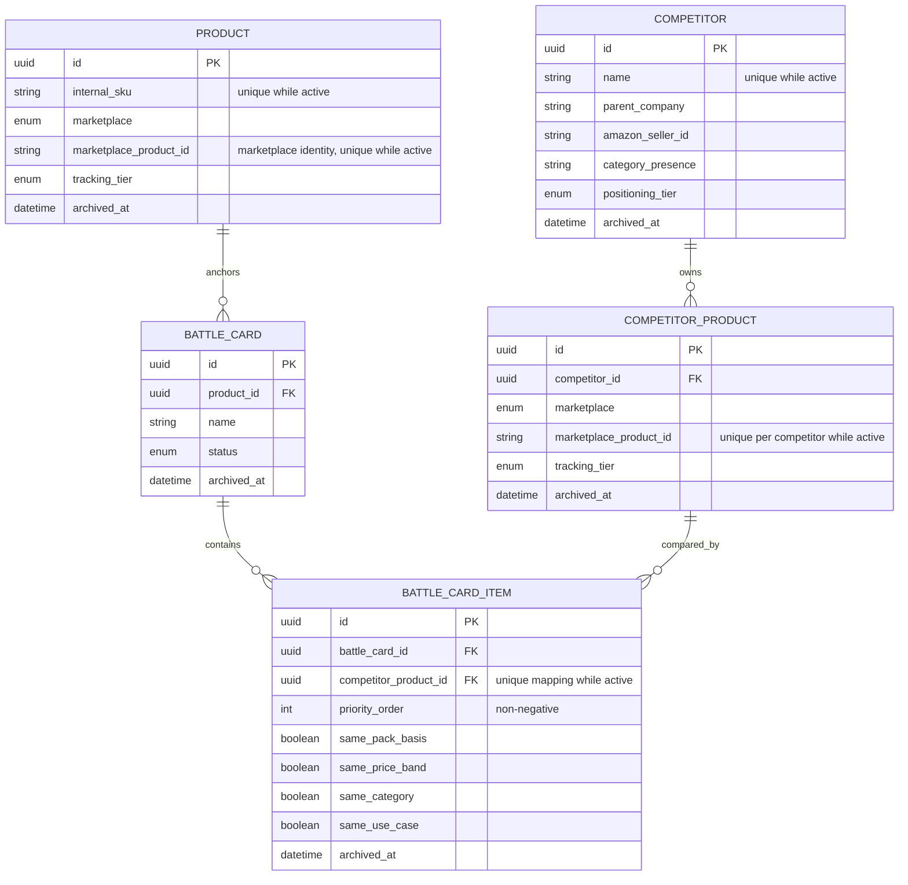

# S1 Universe ER diagram

Active-only unique indexes allow an archived identity to be replaced while preventing two active
records from using the same business identity. Restore operations re-check these constraints.
