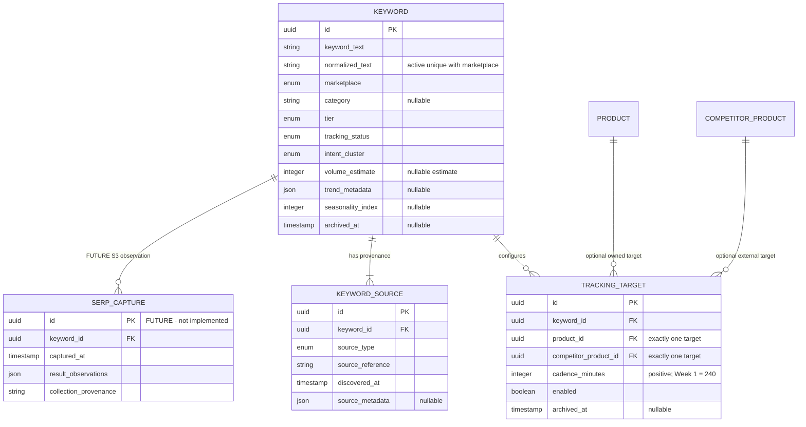

# S2 Keyword Intelligence ER diagram

Active partial unique constraints protect Keyword identity and each target mapping. Foreign keys
use `RESTRICT` for configured targets; source rows use `CASCADE` only at the database relationship
level, while the application exposes no hard-delete operation.

`SERP_CAPTURE` is intentionally shown as a future S3 boundary, not as an implemented S2 table.
SOV, rank history, and keyword gaps are derived from multiple timestamped captures plus S1 listing
identity; they do not belong on the Keyword master.
